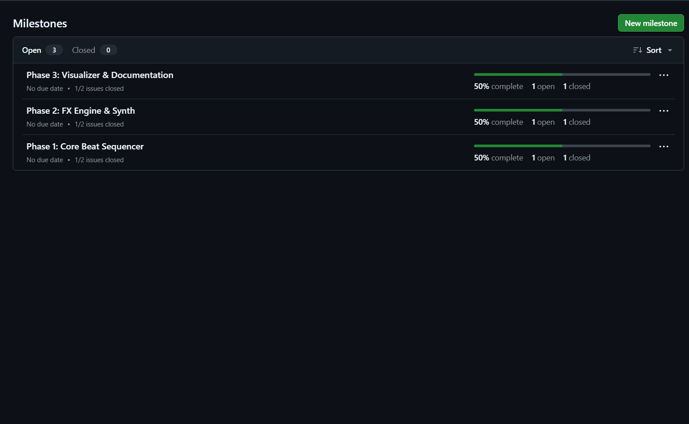
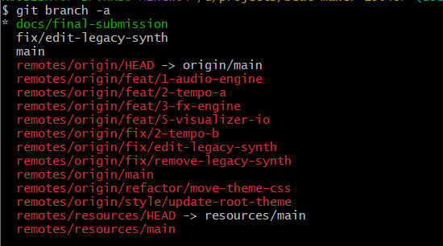
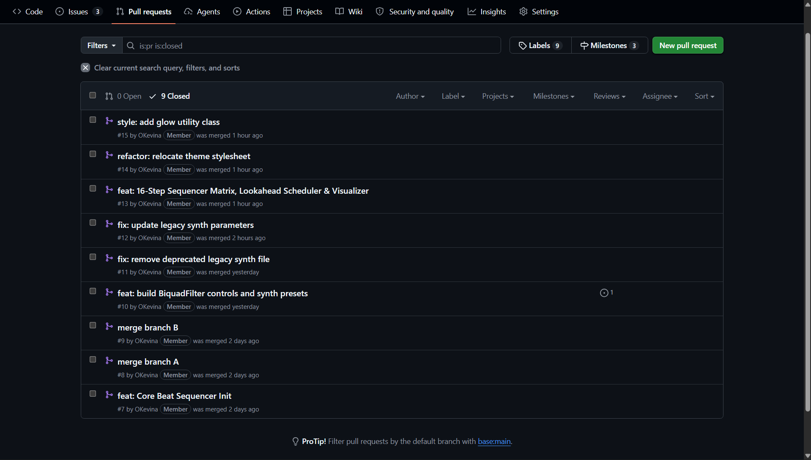
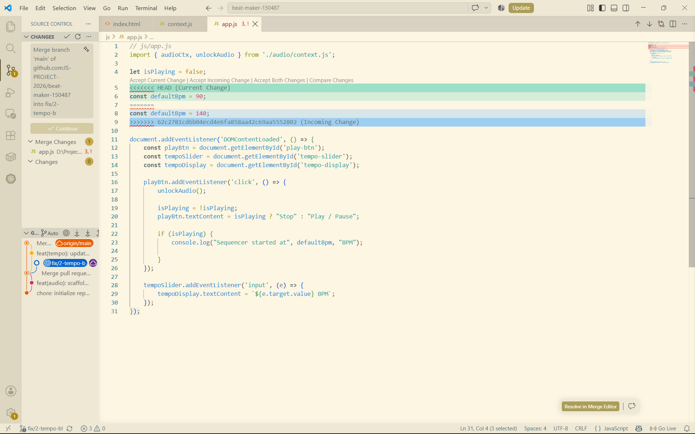
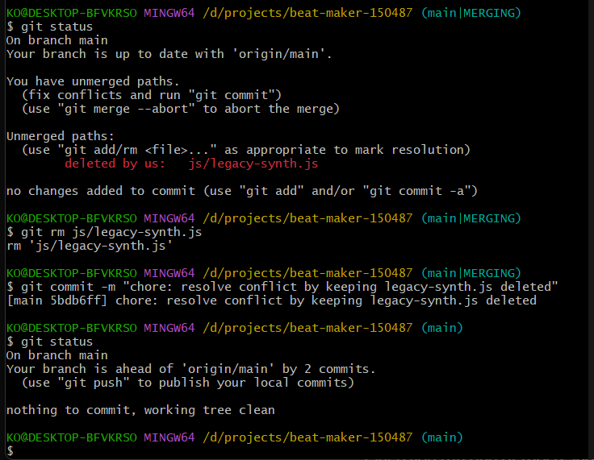
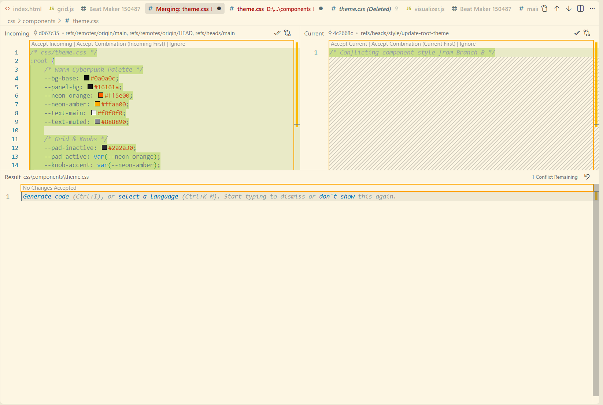

# Project Submission Report

## 1. Student Details

- **Full Name:** Kevin Otieno
- **GitHub Username:** OKevina
- **Email:** kevin.otieno@strathmore.edu

---

## 2. Deployed Project Link

- **Live GitHub Pages URL:** https://is-project-2026.github.io/beat-maker-150487/

---

## 3. Reflection: Grounded in Your Git History

### A. Your Best Commit

- **Commit URL:** https://github.com/IS-PROJECT-2026/beat-maker-150487/commit/891570e
- **Why this one?** This commit cleanly isolates a single feature implementation, adheres strictly to conventional commit standards, and avoids bundling styling or whitespace modifications into the logic.

### B. A Mistake or Struggle

- **Link to the evidence:** https://github.com/IS-PROJECT-2026/beat-maker-150487/pull/1
- **What happened and how did you recover?** When merging branches during refactoring, Git's rename detection completed a clean automatic merge instead of flagging a clash. I recovered by running `git reset --hard HEAD~1`, creating an explicit collision at the destination path, and manually resolving the differences in the editor before recommitting.

### C. A Pull Request You're Proud Of

- **PR URL:** https://github.com/IS-PROJECT-2026/beat-maker-150487/pull/13
- **What did you check before merging?** I verified that the PR body documented the Milestone 3 deliverables, ensured the commit message contained the proper issue closing keyword (`closes #5`), and inspected the diff to ensure the lookahead `StepScheduler` and `AnalyserNode` canvas loop integrated cleanly without leaving debug logs.

### D. One Thing You Would Do Differently

- **What would you change?** I would stage changes more deliberately to maintain atomic commits. In commit `1fc3f38`, I changed 15 files at once, mixing styling refactors, whitespace adjustments, and Web Audio synthesis code into one commit instead of splitting them by scope.
- **Link to the evidence of the original decision:** https://github.com/IS-PROJECT-2026/beat-maker-150487/commit/1fc3f38f81aaa931d73c86c8b9029de8ccf98e11

---

## 4. Screenshots of Key GitHub Features

### A. Milestones and Issues

* **Caption:** Active development milestones with issue progress tracking for core Web Audio deliverables.

### B. Project Board
*Project board tracking was managed directly via GitHub Milestones and repository Issues.*

### C. Branching Architecture

* **Caption:** Branch list showing semantic, issue-linked naming patterns.

### D. Pull Requests & Traceability

* **Caption:** Completed Pull Request linked directly to its tracking issue.

---

## 5. Merge Conflict Evidence

### Conflict 1: Full Chronology

**What cause did you use?** Content Overlap (Simultaneous Line Modification)

#### Step 1: Generating the Clash

* **Caption:** Merge collision generated by simultaneous conflicting edits to the BPM value on line 5 in `js/app.js`.

#### Step 2: Inside the Code Editor (Conflict Markers)

* **Caption:** Raw conflict markers (`<<<<<<< HEAD`, `=======`, `>>>>>>>`) showing the conflicting BPM values in VS Code.

#### Step 3: Resolution & Clean Merge

* **Caption:** Conflict resolved by accepting the incoming 140 BPM tempo setting, staging `js/app.js`, and finalizing the merge commit.

---

### Conflict 2: Different Cause

**What cause did you use?** Delete vs. Modify Conflict

**Why does this cause trigger a conflict?** One branch deleted `js/legacy-synth.js` while another branch modified content inside the same file. Git halts with `CONFLICT (modify/delete)` because it cannot decide whether to preserve the modifications or remove the file.

* **Caption:** Terminal output showing the `deleted by us: js/legacy-synth.js` collision and resolution via `git rm`.

---

### Conflict 3: Different Cause

**What cause did you use?** Rename / Path Relocation Collision (Add/Add Conflict)

**Why does this cause trigger a conflict?** A file was relocated to a new directory path (`css/components/theme.css`) on one branch while a second branch added conflicting component styling at the exact same target path destination.

* **Caption:** Three-way merge editor in VS Code highlighting the stylesheet collision at `css/components/theme.css`.

---

## 6. Feedback & Evaluation

- [x] **Anonymous Evaluation Form:** [Course & Instructor Evaluation](https://forms.gle/YLybnsyXXErKEg3s9)
