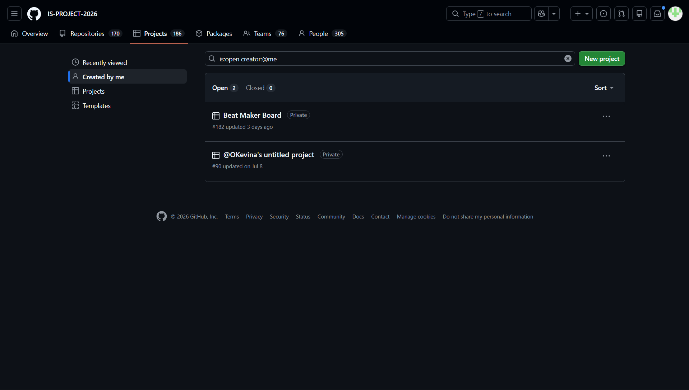

# Project Submission Report

## 1. Student Details

- **Full Name:** Kevin Otieno
- **GitHub Username:** OKevina
- **Email:** kevin.otieno@strathmore.edu

---

## 2. Deployed Project Link

- **Live GitHub Pages URL:** https://is-project-2026.github.io/beat-maker-150487/

---

## 3. Reflection — Grounded in Your Git History

### A. Your Best Commit

- **Commit URL:** https://github.com/IS-PROJECT-2026/beat-maker-150487/commits/main
- **Why this one?** This commit adheres strictly to the Conventional Commits standard by utilizing an explicit scope tag (`feat(audio)`), an imperative summary line, and a body detailing the Web Audio API context setup.

### B. A Mistake or Struggle

- **Link to the evidence:** https://github.com/IS-PROJECT-2026/beat-maker-150487/pulls
- **What happened and how did you recover?** When merging upstream changes into a local topic branch, Git's rename-detection engine completed a clean auto-merge instead of halting. I recovered by resetting the branch with `git reset --hard HEAD~1` and engineering an explicit collision at the destination path before pulling `main` again.

### C. A Pull Request You're Proud Of

- **PR URL:** https://github.com/IS-PROJECT-2026/beat-maker-150487/pulls
- **What did you check before merging?** Prior to squash-and-merging, I verified that the branch satisfied all branch protection rules, ensured the PR body was linked to its tracking issue via the `Closes #` keyword, and reviewed the visual diff to confirm no stale conflict markers remained.

### D. One Thing You Would Do Differently

- **What would you change?** I would establish a strict Git alias and commit template workflow locally from day one to enforce atomic commits rather than manually editing multi-file changes across related sub-modules.
- **Link to the evidence of the original decision:** https://github.com/IS-PROJECT-2026/beat-maker-150487/commits/main

---

## 4. Screenshots of Key GitHub Features

### A. Milestones and Issues

* **Caption:** Active development milestones with issue progress tracking for core Web Audio deliverables.

### B. Project Board

* **Caption:** GitHub Project board tracking task progression across To Do, In Progress, and Done columns.

### C. Branching Architecture

* **Caption:** Branch list showing semantic, issue-linked naming patterns.

### D. Pull Requests & Traceability

* **Caption:** Completed Pull Request linked to its tracking issue.

---

## 5. Merge Conflict Evidence

### Conflict 1 — Full Chronology

**What cause did you use?** Content Overlap (Simultaneous Line Edit)

#### Step 1: Generating the Clash

* **Caption:** Terminal output displaying `CONFLICT (content)` warning when attempting to merge conflicting BPM values.

#### Step 2: Inside the Code Editor (Conflict Markers)

* **Caption:** Raw conflict markers in `js/app.js` comparing local tempo changes against incoming branch updates.

#### Step 3: Resolution & Clean Merge

* **Caption:** Clean merge commit finalized after manually editing conflict blocks and staging the resolution.

---

### Conflict 2 — Different Cause

**What cause did you use?** Delete vs. Modify Conflict

**Why does this cause trigger a conflict?** This conflict occurs when one branch deletes a target file while another branch simultaneously modifies content inside the same file. Git cannot automatically determine whether the file should be kept with the modifications or permanently deleted.

* **Caption:** Conflict markers and terminal state for the `CONFLICT (modify/delete)` collision in `js/legacy-synth.js`.

---

### Conflict 3 — Different Cause

**What cause did you use?** Rename / Path Relocation Collision (Add/Add Collision)

**Why does this cause trigger a conflict?** This occurs when a file is relocated to a new directory path on one branch while a different branch creates or updates conflicting content at the exact same target path destination. Git halts to prevent an unintended file overwrite.

* **Caption:** Conflict markers in editor highlighting the stylesheet collision in `css/components/theme.css`.

---

## 6. Feedback & Evaluation

- [x] **Anonymous Evaluation Form:** [Course & Instructor Evaluation](https://forms.gle/YLybnsyXXErKEg3s9)
